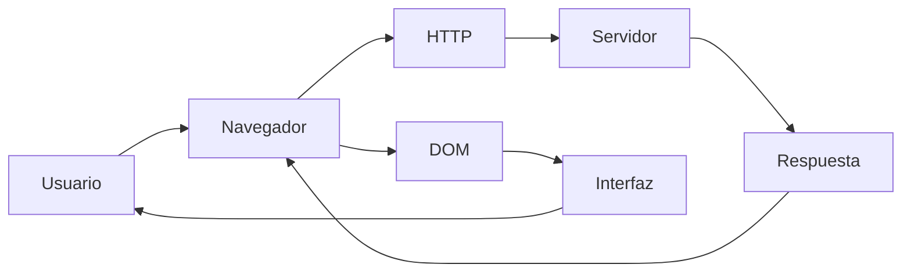
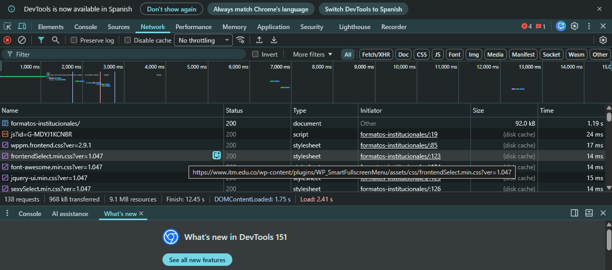
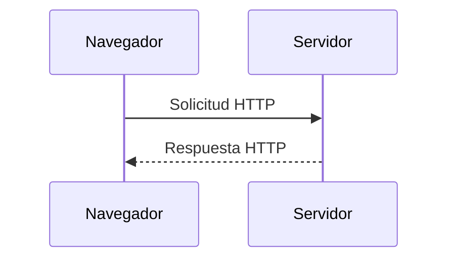
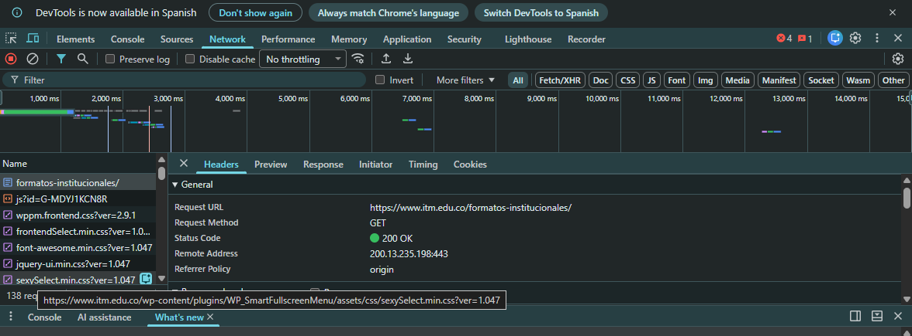
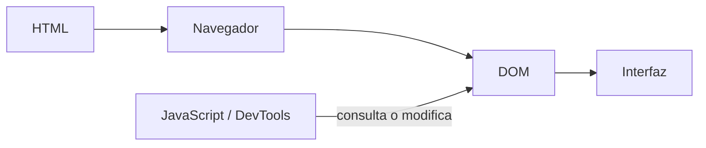
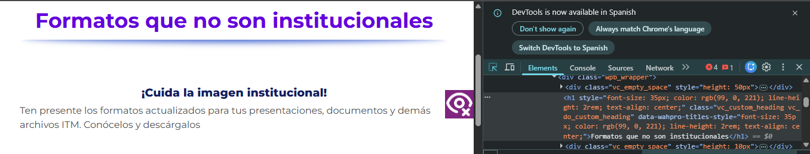
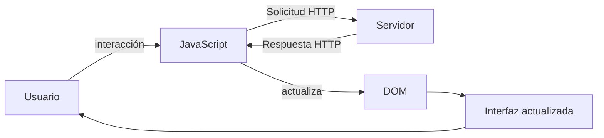
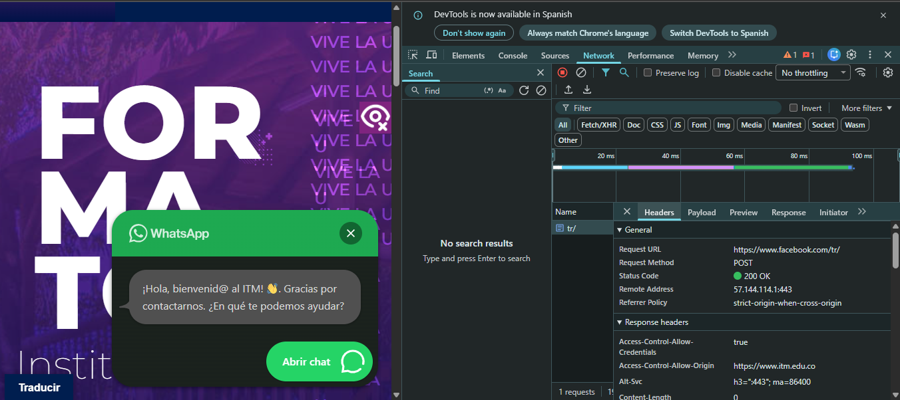

# Laboratorio 01 --- Análisis del funcionamiento de una aplicación web

> **Curso:** Aplicaciones y Servicios Web\
> **Modalidad:** Práctica de laboratorio\
> **Entrega:** Repositorio GitHub --- archivo `README.md`\
> **Evidencias:** Carpeta `evidencias/`

------------------------------------------------------------------------

## Objetivo de la práctica

Analizar el funcionamiento de una aplicación web real mediante las
herramientas de desarrollo del navegador, identificando los recursos
cargados, las solicitudes y respuestas HTTP, la estructura DOM y las
interacciones entre cliente y servidor.

## Resultado esperado

Al finalizar la práctica, el estudiante deberá poder reconstruir y
documentar el flujo observado entre:



> El diagrama anterior representa los **componentes que serán
> analizados**. El diagrama final de la práctica deberá ser construido
> por el estudiante a partir de sus propias observaciones.

------------------------------------------------------------------------

# 1. Preparación del entorno

1.  Ingrese a la aplicación web indicada por el docente.
2.  Abra las **herramientas de desarrollo** del navegador.
3.  Identifique las herramientas **Red / Network** y **Elementos /
    Elements**.
4.  Cree la siguiente estructura dentro del repositorio:

``` text
laboratorio-01/
├── README.md
└── evidencias/
```

El archivo `README.md` será el informe de la práctica. La carpeta
`evidencias/` contendrá las capturas utilizadas para sustentar los
resultados.

------------------------------------------------------------------------

# 2. Identificación de recursos de la aplicación

Abra la herramienta **Red / Network** y recargue completamente la
aplicación.

Observe las solicitudes generadas durante la carga e identifique como
mínimo **cinco recursos**, procurando seleccionar tipos diferentes:
documento HTML, CSS, JavaScript, imágenes, fuentes u otros.

## Resultados

Complete la tabla:

  Recurso   Tipo               Dominio              Tamaño
  --------- ------     ------------------------    --------
  HTML      script         www.itm.edu.co           479 kb 
  CSS       stylesheet     www.itm.edu.co           124 kb  
  HTML      Script         www.itm.edu.co            101 kb
  IMG       GIF            www.itm.edu.co             182 kb
  DOC       document       www.itm.edu.co            92 kb
                             

**Total de solicitudes observadas:** `__5___`

## Evidencia

Guarde una captura de la pestaña Network como:

``` text
evidencias/network.png
```

Inclúyala aquí:

``` markdown

```

### Análisis

**¿Por qué una sola URL puede generar múltiples solicitudes HTTP?**

> Escriba aquí su respuesta.
Una sola URL puede generar múltiples solicitudes HTTP porque la página necesita cargar diferentes recursos, como archivos CSS, JavaScript, imágenes, fuentes y otros datos. Por eso, al abrir una página, el navegador realiza varias solicitudes al servidor para obtener todos los elementos necesarios para mostrarla correctamente.

------------------------------------------------------------------------

# 3. Análisis de una solicitud HTTP

En **Network**, seleccione una de las solicitudes realizadas por el
navegador, preferiblemente la correspondiente al documento principal.

Identifique la información solicitada a continuación.

  Elemento              Resultado
  --------------------- -----------
  URL                   https://www.itm.edu.co/formatos-institucionales/
  Método HTTP           GET
  Código de estado      200 OK
  Host / dominio        www.itm.edu.co
  Tipo de recurso       document
  Tiempo de respuesta   1.19 s

## Flujo que se está observando



## Evidencia

Guarde una captura de los detalles de la solicitud como:

``` text
evidencias/request.png
```

Inclúyala en el informe:

``` markdown

```

### Análisis

**¿Qué recurso solicitó el navegador?**

> Escriba aquí su respuesta.

El recurso solicitado fue : formatos-institucionales y es de tipo: document 

**¿Qué información permite determinar si la solicitud fue atendida
correctamente?**

> Escriba aquí su respuesta.

lo que nos permite saber si la solicitud fue atendida de manera correcta es el status code, que en este caso está asi: 200 ok. 

------------------------------------------------------------------------

# 4. Inspección del DOM

Seleccione un elemento visible de la aplicación, por ejemplo:

-   un botón;
-   un título;
-   un enlace;
-   un campo de formulario;
-   un elemento del menú.

Utilizando **Elementos / Elements**:

1.  Localice el elemento dentro del DOM.
2.  Identifique la etiqueta HTML utilizada.
3.  Modifique temporalmente su contenido desde las herramientas de
    desarrollo.
4.  Observe el cambio producido en la interfaz.
5.  Registre la evidencia.

## Resultados

**Elemento seleccionado:** `Titulo`

**Etiqueta HTML:** `<h1>`

**Contenido original:** `FORMATOS INSTITUCIONALES `

**Modificación realizada:** `FORMATOS QUE NO SON INSTITUCIONALES `

El proceso observado puede representarse conceptualmente así:



## Evidencia

Guarde la captura como:

``` text
evidencias/dom.png
```

Inclúyala aquí:

``` markdown

```

### Análisis

**¿La modificación realizada sobre el DOM alteró permanentemente la
aplicación o los archivos almacenados en el servidor? Justifique.**

> Escriba aquí su respuesta.

No, la modificación realizada sobre el DOM no altera permanentemente la aplicación ni los archivos del servidor. Estos cambios solo se realizan temporalmente en el navegador mediante las herramientas de inspección. Al recargar la página, los cambios desaparecen porque los archivos originales del servidor no fueron modificados.

------------------------------------------------------------------------

# 5. Análisis de una interacción dinámica

Regrese a **Network** y limpie las solicitudes registradas.

Realice una acción dentro de la aplicación que pueda generar una
interacción con el servidor, por ejemplo:

-   consultar;
-   buscar;
-   filtrar;
-   seleccionar una opción;
-   enviar información.

Observe si aparece una nueva solicitud en Network.

## Resultados

  Elemento                       Resultado
  ------------------------------ -----------
  Acción realizada               Seleccionar una opción 
  ¿Generó una nueva solicitud?   sí
  URL solicitada                 https://www.facebook.com/tr/
  Método HTTP                    POST
  Código de estado               200 OK
  Tipo de respuesta              document-  tr/

## Ciclo de interacción

Utilice este esquema únicamente como referencia conceptual para
interpretar lo observado:



## Evidencia

Guarde la captura como:

``` text
evidencias/interaccion.png
```

Inclúyala aquí:

``` markdown

```

### Análisis

**Explique la relación entre la acción realizada por el usuario y la
solicitud observada.**

> Escriba aquí su respuesta.

La acción realizada por el usuario genera una solicitud HTTP porque el navegador necesita comunicarse con el servidor para obtener o enviar información. Por ejemplo, al presionar un botón de consultar o buscar, el navegador envía la solicitud correspondiente y el servidor responde con los datos necesarios para actualizar la página.

------------------------------------------------------------------------

# 6. Reconstrucción del flujo observado

A partir de **sus propias evidencias**, construya un diagrama Mermaid
que represente el funcionamiento de la aplicación analizada.

El diagrama deberá incluir, cuando corresponda:

`Usuario` · `Navegador` · `JavaScript` · `Solicitud HTTP` · `Servidor` ·
`Respuesta HTTP` · `DOM` · `Interfaz`

> **No copie los diagramas anteriores.** Esta sección debe representar
> el flujo que usted pudo comprobar durante la práctica.

Reemplace el siguiente bloque con su diagrama:

``` mermaid
flowchart LR
    Usuario->>Interfaz: Selecciona una opción
    Interfaz->>DOM: Detecta la acción
    DOM->>JavaScript: Ejecuta el evento
    JavaScript->>Navegador: Genera la solicitud HTTP
    Navegador->>Servidor: Envía la solicitud HTTP (GET/POST)
    Servidor-->>Navegador: Respuesta HTTP (200 OK)
    Navegador->>JavaScript: Entrega los datos
    JavaScript->>DOM: Actualiza el contenido
    DOM->>Interfaz: Muestra la información al usuario
```

------------------------------------------------------------------------

# 7. Observado vs. inferido

Una herramienta de desarrollo permite observar una parte del sistema,
pero no necesariamente todo lo que ocurre en el servidor.

Clasifique sus hallazgos:

## Elementos observados directamente

-   El código de estado de la respuesta en nuestro caso --> 200 ok 
-   El tiempo de respuesta y el tipo de recurso en la pestaña Network.
-   La solicitud HTTP enviada al seleccionar una opción.

## Elementos inferidos

-   El servidor procesa la solicitud antes de responder.
-   El servidor consulta o genera la información que devuelve.
-   JavaScript actualiza el dom con la información recibida para reflejar el cambio en la interfaz.

> No presente como observado un proceso interno que las herramientas del
> navegador no permitan comprobar directamente.

------------------------------------------------------------------------

# 8. Conclusiones

Redacte **tres conclusiones técnicas** derivadas de la práctica.

1.  El análisis de las solicitudes permite identificar información como el método HTTP, código de estado, tipo de respuesta y tiempo de respuesta, elementos que ayudan a determinar cómo se comunica la aplicación con el servidor.
2.  Las herramientas de desarrollo permiten observar y modificar temporalmente el DOM desde el navegador, pero estos cambios no modifican los archivos originales del servidor.
3.  La pestaña Network permite comprobar que las acciones realizadas en una aplicación web generan solicitudes HTTP, lo que evidencia la comunicación entre el navegador y el servidor.

Las conclusiones deben explicar lo aprendido a partir de la evidencia y
no limitarse a describir las actividades realizadas.

------------------------------------------------------------------------

# 9. Entrega

La estructura final esperada es:

``` text
laboratorio-01/
├── README.md
└── evidencias/
    ├── network.png
    ├── request.png
    ├── dom.png
    └── interaccion.png
```

Antes de entregar, verifique:

-   [ ] El `README.md` se visualiza correctamente en GitHub.
-   [ ] Las imágenes se muestran dentro del README.
-   [ ] Se documentaron al menos cinco recursos.
-   [ ] Se analizó una solicitud HTTP.
-   [ ] Se identificó y modificó un elemento del DOM.
-   [ ] Se analizó una interacción de la aplicación.
-   [ ] El diagrama final corresponde a lo observado.
-   [ ] Se diferenciaron elementos observados e inferidos.
-   [ ] Se redactaron tres conclusiones técnicas.
-   [ ] Se realizó `commit` y `push` al repositorio.

------------------------------------------------------------------------

## Criterio de documentación

> **Las capturas son evidencia, no la respuesta.**

Cada evidencia debe estar acompañada por una explicación que indique
**qué se observó, qué significa y cómo se relaciona con el
funcionamiento de la aplicación web**.
